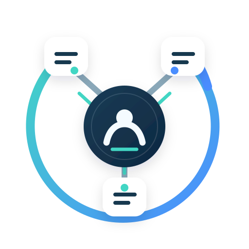

# Agent Orchestrator — Multi-agent orchestration skill for Codex

[中文说明](README.md)

[](https://github.com/mengxiangsama/codex-agent-orchestration-skill/actions/workflows/validate.yml)

<p align="center"></p>

Agent Orchestrator helps a lead agent break down a task, delegate to subagents, coordinate independent work in parallel, and check deliverables before handing back a result. It keeps analysis, design, implementation, and review within the scope you requested. Its orchestration rules are independent of programming language and domain; they are not tied to Java or any particular stack.

This repository provides a **Codex skill containing orchestration rules**. The host provides the actual multi-agent tools, execution permissions, workspace isolation, and resource limits. Installing the skill does not add those capabilities. Simple or tightly coupled tasks stay with the lead agent; when delegation tools or authorization are missing, it explains the limitation and works through the stages itself.

## Install with the skill installer

If your host provides `$skill-installer`, paste this request:

```text
Use $skill-installer to install the skill named agent-orchestrator from the
repository root (path .) of https://github.com/mengxiangsama/codex-agent-orchestration-skill.
Confirm which local skill directory this host supports before installing.
If a copy already exists, preserve it and report its location; do not overwrite
it or install a duplicate.
```

## Quick start

1. Install using the request above or the manual instructions below, and confirm that your host discovers `agent-orchestrator/SKILL.md`.
2. Invoke `$agent-orchestrator` with your goal, permitted changes, and expected result. The skill name stays the same in every language.
3. The lead agent checks scope and available tools, decides whether delegation helps, and verifies the resulting work before reporting what was completed and what remains unverified.

Use any of these three prompts in a project you want to work on.

### Analysis or review: read only

```text
Use $agent-orchestrator to review this project's order export module.
Only analyze and report findings; do not modify any files.
Include file and line references, likely impact, and uncertainties.
Delegate independent checks only if the available tools and permissions allow it.
```

### Implementation

```text
Use $agent-orchestrator to improve this project's CLI argument parsing and
usage documentation. Implement the changes and run the relevant tests.
Inspect the existing behavior first and preserve unrelated local changes.
Proceed when requirements are clear; ask about missing rules that affect behavior.
Assign non-overlapping files and verify prerequisites before dependent work starts.
Do not commit, publish, or deploy.
```

### Design only

```text
Use $agent-orchestrator to design a coupon-based order payment module.
Deliver only a design proposal in your response: rules, interfaces, states,
failure handling, open questions, and proposed acceptance tests.
Do not modify files or implement the module. Identify missing business rules
instead of adopting rules from the skill's examples as project requirements.
```

## Installation and updates

Use a host that supports local `SKILL.md` packages. The official [Where Codex loads local skills](https://learn.chatgpt.com/docs/build-skills#where-codex-loads-local-skills) documentation lists `$HOME/.agents/skills` as the user-level directory. The manual examples below use that location and require Git. **Confirm the directories your host actually scans** before running them, and avoid multiple copies named `agent-orchestrator` across scanned directories.

If an installation in `~/.codex/skills` or another directory already works, keep it there and update that original installation using its actual path. Do not clone another copy or migrate the working installation just to match these examples.

For a new installation on macOS or Linux:

```bash
git clone https://github.com/mengxiangsama/codex-agent-orchestration-skill.git "$HOME/.agents/skills/agent-orchestrator"
```

For a new installation in Windows PowerShell:

```powershell
git clone https://github.com/mengxiangsama/codex-agent-orchestration-skill.git "$env:USERPROFILE\.agents\skills\agent-orchestrator"
```

If the destination already exists, inspect it first to determine whether it is a previous clone or a customized copy. Preserve local changes; do not overwrite the directory or force-reset it to resolve an update conflict.

For an existing Git clone, update it in place. These commands match the new-install examples; substitute your original installation path if it differs:

```bash
git -C "$HOME/.agents/skills/agent-orchestrator" pull --ff-only
```

In PowerShell, the equivalent is:

```powershell
git -C "$env:USERPROFILE\.agents\skills\agent-orchestrator" pull --ff-only
```

A copied installation does **not** update when you run `git pull` in a separate source checkout. A host installer may create a file copy without `.git`; that copy cannot be updated with `git pull`. Review and preserve customizations, back up the old copy outside all scanned directories, then replace it using your installation method.

If the skill is missing from the discovery list, verify that `agent-orchestrator/SKILL.md` is in a scanned directory. Refresh the list or start a new session; restart the client if necessary. Windows and WSL use different home directories.

## Why not always use three roles?

A fixed designer/developer/tester team can add coordination work to a small task or start a task before its inputs are ready. Agent Orchestrator chooses roles and task counts from the actual dependencies and the value of an independent check.

The lead agent handles simple work directly. For larger work, it delegates only independent tasks that shorten the path to completion or provide useful verification, while retaining useful work of its own. An implementation task can depend on an accepted design; an unrelated review may run in parallel. A design-only request ends with the design.

## Dependencies, ownership, and acceptance

- Record each task's owner, dependencies, permitted write paths, deliverables, acceptance criteria, and status. A short note is enough for simple work.
- Start dependent work only after the lead agent accepts its prerequisites. The executor receives the accepted version explicitly; the existence of a file or a subagent's completion message is insufficient.
- Give every writer a non-overlapping scope. Concurrent writes to the same file or overlapping parent/child directories require different ownership or serial execution. Shared workspaces and Git worktrees still need integration checks.
- Give each subagent a self-contained brief with inputs, scope, exclusions, validation requirements, and handling for blockers. By default, only the lead agent delegates; subagents do not delegate recursively.
- Treat a returned result as `submitted`. The lead agent reads actual artifacts and checks evidence before marking it `accepted` or returning specific issues for rework.
- Limit each task to two execution attempts by default: the first attempt and one rework. Changes to that budget require new evidence and a recorded reason. This is an attempt budget, not a host concurrency limit.
- When an accepted prerequisite changes, stop affected work and confirm it has stopped before invalidating old acceptance, handing over the new accepted version, and checking affected results again.

See the [dispatch templates](references/dispatch.md), [task ledger](references/ledger.md), and [acceptance checklist](references/acceptance.md) for the working details.

Parallelism is not limited to frontend/backend roles. Two backend modules, such as coupon calculation and order creation, can share an accepted method contract and implement independently in separate files. A runtime call between them is not automatically a development dependency. Review each result as it arrives, return specific issues to its owner while unaffected work continues, and integrate the real implementations only after both pass their own acceptance criteria. Contract-based mocks or stubs support module tests but do not prove integration. Actual prerequisite artifacts, conflicting writes, or host limits may still require waiting or serial execution. See [collaboration boundaries and parallel work](references/parallel-boundaries.md).

One lead agent retains control of planning, dispatch, rework, acceptance, and integration. Workers execute their assigned tasks and report cross-task issues to the lead; parallel execution does not give them authority to direct other workers.

## Risk-based independent review

Small, low-risk changes stay with the lead for verification; an extra reviewer is not mandatory for every task. Changes that materially affect monetary results, authorization boundaries, data integrity, or critical shared contracts require a reviewer who did not implement that change. Honor explicit user requests for independent review as well. Assess actual impact, not directory names or line counts.

The review brief includes the original requirements, accepted contracts, a stable candidate and baseline, the actual diff, and version-matched test evidence. The reviewer reports findings; only the lead accepts the deliverable. A submitted candidate may be inspected during acceptance, but it is not yet an accepted prerequisite for downstream implementation.

After fixes, recheck the original findings, fix diff, and affected regressions. Expand review if the contract or impact changes; unaffected tasks can continue. Re-review does not reset the implementation attempt budget, and review approval does not replace final integration checks. If independent review is unavailable, disclose the unmet gate rather than calling self-review independent or accepting the high-risk result prematurely. See the [review procedure and templates](references/review.md) and [teaching examples](examples/risk-based-review.md).

## Verification you can run

Using the skill instructions does not require Python. The optional validators and repository tests require Python 3.9+ and use only the standard library.

Run these commands **from the repository root**:

```bash
python3 scripts/validate_package.py
python3 -B -m unittest discover -s tests -v
python3 scripts/check_ledger.py examples/accepted-run.json
python3 scripts/check_ledger.py evals/reports/observed-run.json
```

Run the quote fixture's implementation and independent acceptance tests **with `evals/artifacts/coupon` as the working directory**. Starting at the repository root:

```bash
cd evals/artifacts/coupon
python3 -B -m unittest discover -s tests -v
python3 -B -m unittest discover -s oracle -v
```

On Windows, use `py -3` instead of `python3` if that is your Python launcher. The [CI workflow](.github/workflows/validate.yml) configures Python 3.12 on Ubuntu, macOS, and Windows, plus Python 3.9 on Ubuntu. Check the badge for CI status on the published repository.

The [validation report dated 2026-09-28](evals/reports/validation.md) records 81 passing test methods on local macOS with Python 3.13.7: 49 ledger tests, 6 package tests, 17 quote implementation tests, and 9 independent quote tests. This is dated evidence from synthetic tasks, not a guarantee for every model, client, or future run.

The report also describes observed host subagent calls, design acceptance before implementation, parallel work, and bounded rework. It distinguishes deliberately injected failures and delegation restrictions from naturally occurring errors. The public record summarizes those observations; it is not an independently authenticated raw tool trace.

The additional [pagination orchestration exercise dated 2026-09-29](evals/artifacts/pagination/report.md) preserves a rejected design, its accepted revision, a real missing-input failure, recovery before a second implementation attempt, and main-agent acceptance. Its 17 implementation tests plus 20 independent tests pass in the original local run. The 150 seeded cases are subcases of one method, not 150 extra tests. Both injected faults were known in advance; a separate patch-tool error is also disclosed.

Use the [reusable exercise request](evals/pagination-prompt.md) in a new temporary directory to evaluate actual delegation, or follow the report's commands to rerun the published Python tests offline. CI runs artifact tests and record checks, not real model orchestration. Public logs have local paths redacted and are not authenticated raw tool traces. This addition does not change the skill's core instructions.

Package checks validate metadata, links, and resources. Ledger checks validate internal consistency of recorded states, dependencies, versions, ownership, and budgets. Neither proves that tool calls happened or that business behavior is correct. The implemented fixture covers quote calculation only; the full order/payment walkthrough is a teaching example, not an implemented or production-tested payment system.

The [module-parallelism regression tests](tests/test_parallel_contract.py) exercise synthetic records for contract acceptance, parallel modules, completion-order acceptance, local rework, integration gating, and contract changes. They do not run agents or demonstrate a real order-system integration.

## Project navigation

- [SKILL.md](SKILL.md): invocation description and core orchestration rules.
- [Runtime capabilities](references/runtime.md): discover real tools, handle limits, and fall back when delegation is unavailable.
- [Dispatch and return templates](references/dispatch.md): task briefs, submissions, and rework messages.
- [Task ledger](references/ledger.md): task states, dependency versions, and the optional JSON record format.
- [Acceptance and reporting](references/acceptance.md): inspect deliverables and report verified outcomes.
- [Risk-based review](references/review.md): choose review depth, prepare evidence, and recheck fixes.
- [Collaboration boundaries and parallel work](references/parallel-boundaries.md): shared contracts, independent modules, rolling acceptance, and real integration.
- [Scenarios](examples/scenarios.md): simple tasks, parallel work, rework, failure, and restricted capabilities.
- [Coupon order payment walkthrough](examples/coupon-order-payment.md): synthetic design-to-implementation handoff and a design-only branch.
- [Ledger checker](scripts/check_ledger.py): optional record consistency checks.
- [Evaluation guide](evals/README.md): evaluation scenarios and evidence boundaries.
- [Dated validation report](evals/reports/validation.md): observed results, reproduction commands, and unverified areas.
- [Pagination exercise and evidence](evals/artifacts/pagination/report.md): two-attempt design rework, dependency gating, failure/recovery, and 37 executable tests.
- [Reusable pagination exercise request](evals/pagination-prompt.md): a known-fault exercise for a host with actual subagent tools.

The core rules and supporting guides are currently written in Chinese; this README provides an English entry point.

## Limitations

- This skill is a set of instructions, not a runtime, security sandbox, background service, or durable task queue. It cannot guarantee that a model follows every rule.
- Tools, permissions, isolation, and concurrency limits belong to the host. An undisclosed concurrency limit remains unknown; a chosen batch size does not establish a platform limit.
- Installing the skill does not authorize publishing, deployment, deletion, paid actions, or external messages. Delegated work stays within the original authorization.
- File ownership is a coordination agreement. It does not prevent writes by external processes or enforce filesystem isolation.
- After a restart, recheck actual tool state, files, prerequisite versions, and evidence. There is no automatic recovery guarantee.
- Other clients and models, remote workspace transfers, larger concurrency scales, and production projects are not established as compatible or verified by the published evaluation. No search ranking or discoverability outcome is guaranteed.

For a reproducible issue, include the request, host capabilities, expected versus actual behavior, and evidence safe to publish. Remove credentials, private paths, and real business data.

## License

[MIT](LICENSE).
