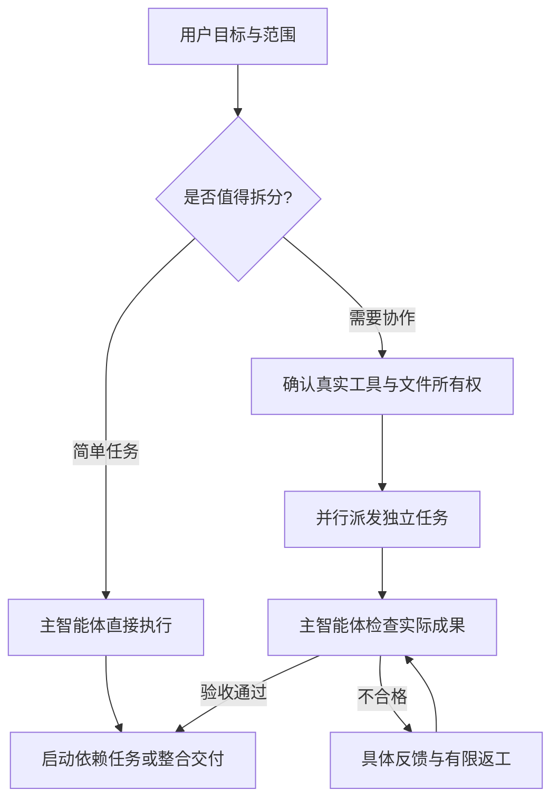

# Agent Orchestrator — Codex 多智能体编排 Skill

简体中文 | [English](README.en.md)

[](https://github.com/mengxiangsama/agent-orchestrator/actions/workflows/validate.yml)

**你说目标，主智能体按需拆任务、调度子智能体、验收成果，再统一交付。**

`agent-orchestrator` 是适用于 Codex 的通用多智能体协作 Skill，封装任务拆分、子智能体调度、依赖管理、并行执行和成果验收规则。适合需要协调多个 coding agents 的开发、文档和代码审查任务，不限定 Java、Python、JavaScript 或某个业务领域。

A Codex multi-agent orchestration skill for task planning, subagent delegation, dependency-aware parallel execution, and verified delivery. Language- and domain-independent.

不是每次都创建三个角色，也不是“多开几个聊天”。简单任务直接完成；复杂任务按实际依赖和工具能力组织协作。

[快速开始](#快速开始) · [使用场景](#使用场景) · [工作方式](#实际工作方式) · [真实验证记录](evals/reports/validation.md) · [常见问题](#常见问题)

> Skill 提供调度规则，不是独立 Agent 框架。真正的子智能体工具、权限和并发能力由运行环境提供；安装本 Skill 不会自动获得这些能力。

## 快速开始

在提供 `skill-installer` 的 Codex 环境中发送：

```text
使用 $skill-installer 从 https://github.com/mengxiangsama/agent-orchestrator 安装仓库根目录的 agent-orchestrator Skill。已有同名安装时先检查，不要直接覆盖。
```

安装后，在你的项目中提出任务，例如：

```text
使用 $agent-orchestrator 完善 CLI 参数解析及使用文档，完成实现和测试。
先确认范围，再判断是否需要子智能体；互不依赖的任务可以并行。
检查实际交付物后报告结果，不提交、不发布代码。
```

无需为了使用这些指令安装 Python 或配置本项目专属 API Key；运行模型、调用工具所需的账户、权限和费用仍取决于宿主。手动安装和更新见下文。

## 使用场景

| 你提出的任务 | 调度方式与交付边界 |
| --- | --- |
| 修正一处文档或小问题 | 主智能体直接完成，不强行拆分 |
| 开发功能并补独立文档 | 按真实依赖和文件所有权决定能否并行 |
| 设计后再实现一个模块 | 主智能体验收设计后，才启动依赖设计的编码任务 |
| 只审查代码或只做设计 | 交付问题报告或方案，不擅自修改业务代码 |

## 为什么不只是多开几个 Agent

- 区分分析、设计、实现、审查，保持用户原始范围。
- 生成自包含子任务提示词，不依赖隐含聊天历史。
- 独立任务并行；前置成果**主验收通过**后才启动依赖任务。
- 划分写入所有权，避免多个执行者同时修改同一文件。
- 区分执行者提交和主智能体验收，按具体问题有限返工。
- 前置设计改变后暂停、通知受影响任务并重新验收。
- 工具缺失时明确降级为单智能体，不假装已经派发。

它不提供进程守护、任务队列、跨会话自动恢复或额外 API 额度，也不保证所有客户端兼容。

## 安装

需要支持本地 `SKILL.md` 的宿主和 Git。当前 [OpenAI 官方安装目录说明](https://learn.chatgpt.com/docs/build-skills#where-codex-loads-local-skills) 将 `~/.agents/skills` 列为用户级目录，下面用于**全新手动安装**。如果已经在 `~/.codex/skills` 等宿主实际扫描目录安装且可用，保留原安装，不要再复制一份。

macOS / Linux：

```bash
git clone https://github.com/mengxiangsama/agent-orchestrator.git "$HOME/.agents/skills/agent-orchestrator"
```

Windows PowerShell（本项目安装不需要 Bash）：

```powershell
git clone https://github.com/mengxiangsama/agent-orchestrator.git "$env:USERPROFILE\.agents\skills\agent-orchestrator"
```

发现列表未更新时，刷新列表或新开会话；仍不显示再重启客户端。检查扫描目录下是否确实存在 `agent-orchestrator/SKILL.md`。WSL 与 Windows 的用户目录不同。

目录已存在时不要直接覆盖；检查是之前的安装还是自定义副本。本方式将仓库直接克隆到 Skill 目录，macOS / Linux 更新可执行：

```bash
git -C "$HOME/.agents/skills/agent-orchestrator" pull --ff-only
```

Windows PowerShell：

```powershell
git -C "$env:USERPROFILE\.agents\skills\agent-orchestrator" pull --ff-only
```

若原安装使用 `.codex/skills` 或自定义路径，将上面命令中的目录换成**实际安装目录**，不要因此迁移或新建重复副本。

若只更新另一个源码目录，不会同步已复制的安装副本。有本地修改先审查并保留；不要使用强制重置来解决更新冲突。

若通过宿主的 **Skill 安装器** 下载本仓库，通常得到的是文件副本而不是 Git 克隆。没有 `.git` 的副本不能用 `git pull` 更新：先核对并保留自定义内容，将旧副本备份到扫描目录之外，再通过安装器安装新版本。不要对已有目录盲目覆盖，也不要把源码更新误认为副本已经同步。

## 调用

```text
使用 $agent-orchestrator 检查这个项目的订单导出模块，只报告问题，不改代码。
```

```text
使用 $agent-orchestrator 完善 CLI 参数解析及其使用文档，完成实现和测试。
需求明确时自动推进，只有影响业务结果的规则不明确时再问我。
```

```text
使用 $agent-orchestrator 设计优惠券订单支付模块，先只给设计，不写业务代码。
```

不要只用“你是设计师/程序员/测试员”来定义任务；分发提示词会包含输入、验收版本、读写范围、交付位置、验证要求和阻塞处理。

## 实际工作方式



这是流程示意，不是执行日志。没有可用委派工具或授权时，明确降级为主智能体分阶段执行。

1. 确认请求模式、关键规则和范围；简单任务由主智能体完成。
2. 有委派价值时核对真实工具，记录实际 agent ID 和本轮预算。
3. 建依赖和文件所有权；只派发前置已验收的任务。
4. 子智能体返回 `submitted`；主智能体打开交付物、核对证据。
5. 接受、返工或说明阻塞；必要集成检查后报告结果。

默认只有主智能体派发，每任务最多两次执行尝试；有具体新证据才调整预算。这个策略不意味着宿主固定支持两名子智能体。没有暴露并发上限时必须承认未知，不能编造平台参数。

## 看一次真实验收

[2026-09-28 验证报告](evals/reports/validation.md) 记录了隔离合成任务中的真实工具调用和文件检查，包括两个任务并行、设计验收后编码、故障注入后的返工，以及只设计不实现的边界。

你可以直接检查一条“设计 → 实现 → 独立检查”证据链：

- [已验收的报价设计](evals/artifacts/coupon/docs/design.md)
- [最终报价函数](evals/artifacts/coupon/src/payment.py)
- [主智能体独立测试](evals/artifacts/coupon/oracle/test_quote_contract.py)

这是优惠券支付示例中的**报价子场景**，不是完整支付系统或生产部署；已有结果不保证其他模型、客户端或未来任务都成功。完整复测命令与未验证部分见报告。

## 项目内容

| 文件 | 用途 |
| --- | --- |
| [SKILL.md](SKILL.md) | 触发条件与核心调度流程 |
| [references/runtime.md](references/runtime.md) | 工具发现、能力限制与降级 |
| [references/dispatch.md](references/dispatch.md) | 自包含任务、成果返回、返工模板 |
| [references/ledger.md](references/ledger.md) | 轻量状态表和可选 JSON 记录契约 |
| [references/acceptance.md](references/acceptance.md) | 主验收和最终报告模板 |
| [examples/scenarios.md](examples/scenarios.md) | 简单、并行、失败、返工和设计模式示例 |
| [examples/coupon-order-payment.md](examples/coupon-order-payment.md) | 合成业务案例，不绑定具体语言 |
| [scripts/check_ledger.py](scripts/check_ledger.py) | 可选的记录一致性检查器，不是调度程序 |
| [evals/README.md](evals/README.md) | 行为评估方法、场景与证据边界 |
| [evals/reports/validation.md](evals/reports/validation.md) | 本次真实验证结果及未验证部分 |

## 验证

使用 Skill 的指令不依赖 Python。只有运行可选确定性检查器和仓库测试时需要 Python 3.9+，全部使用标准库：

```bash
python3 scripts/validate_package.py
python3 -B -m unittest discover -s tests -v
python3 scripts/check_ledger.py examples/accepted-run.json
```

Windows 将 `python3` 换为 `py -3`。CI 覆盖 Ubuntu、macOS、Windows 的 Python 3.12，并在 Ubuntu 上验证 Python 3.9。

验证分层：

- **包检查**：元数据、链接和资源是否完整；不证明模型行为。
- **确定性测试**：JSON 状态、依赖、版本、并发、所有权和预算是否一致；不证明实际工具调用或业务正确性。
- **真实行为评估**：在隔离的合成任务中观察真实子智能体调用、文件和命令结果；结果见验证报告。
- **受限/故障注入评估**：明确标注人为禁用能力、注入失败或不合格交付物，不包装成生产事故或自然出现的模型错误。

## 已知限制与安全

- 验收规则靠宿主执行；Skill 文字不是安全沙箱，也无法保证模型始终遵守。
- 不自动授予发布、部署、删除、付费、外部通信等权限；这些动作仍须在用户授权范围内。
- 文件所有权是协作约定，不能防住外部进程、符号链接或未协调的修改。
- 校验器只能验证输入记录，不核验真实身份、运行日志的真实性、业务规则或实际文件存在。
- 重启后必须重新核对真实状态，不保证自动恢复。
- 示例全部为合成资料。不要提交真实业务数据、凭证、私人路径或未授权代码。

## 常见问题

**装了以后就能自动创建子智能体吗？** 不能。宿主必须实际提供创建、通信、等待/查询和中断能力，并允许本轮委派。普通聊天窗口不等于子智能体。

**能用于非 Java 项目吗？** 能，调度规则不绑定语言。具体项目的编译器、测试工具和业务约束仍需由执行环境提供并核对。

**安装后找不到，或出现两个同名 Skill？** 确认实际扫描目录下有 `agent-orchestrator/SKILL.md`，刷新列表或新开会话，必要时重启。检查 `.agents/skills`、原有 `.codex/skills` 和项目目录是否重复安装；先备份自定义内容，不要盲目覆盖。

**为什么源码 `git pull` 后 Skill 没变？** 源码目录和已复制的安装目录是两份文件。Git 克隆安装要在实际安装目录更新；安装器下载的无 `.git` 副本需要备份后重新安装。更新方法见“安装”一节。

**能直接用于所有 Agent 客户端吗？** 未验证。`SKILL.md` 指令格式可阅读，不代表各宿主都有相同的工具、权限和并发能力。

## 反馈与分享

欢迎通过 Issue 提供脱敏复现：请求、宿主能力、预期与实际行为、可公开的证据。修改调度规则时请补可观察的行为评估，而不只是检查某个句子是否出现在文档中。

如果这个 Skill 帮你完成了实际协作任务，欢迎分享仓库或提交脱敏使用案例。引用验证结果时请同时保留其测试条件与限制，不把流程示意当成真实运行证据。

[MIT License](LICENSE)
